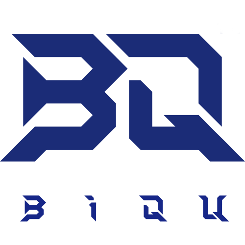

  

# Panda Jetpack for Home Assistant

Custom integration for the **BIGTREETECH Panda Jetpack** LED controller
(Bifrost Engine web interface), controlled over its local WebSocket API.

## Entities

| Entity | Type | Function |
|---|---|---|
| Panda Jetpack | `light` | On/off, brightness (0-100%), light effect selection |
| Effect speed | `number` | Speed of animated effects (0-100%) |

Supported effects: Static, Breathing, Strobing, Wave, Marquee, Color Cycle,
Rainbow, Warning Hot, Fan Speed, H2D Style.

Note: brightness and speed are stored **per effect** by the device, and the
speed slider only affects animated effects (it does nothing for Static / H2D
Style) — the same behaviour as the device's own web interface.

## Installation

### Via HACS (custom repository)

1. Push this folder to a GitHub repository (see structure below).
2. HACS -> three-dot menu -> **Custom repositories** -> add the repo URL,
   category **Integration**.
3. Install "Panda Jetpack" from HACS and restart Home Assistant.

### Manual

1. Copy `custom_components/panda_jetpack/` into your Home Assistant
   `config/custom_components/` folder.
2. Restart Home Assistant.

## Configuration

Settings -> Devices & services -> **Add integration** -> search for
"Panda Jetpack" -> enter the device's IP address. No YAML needed.
